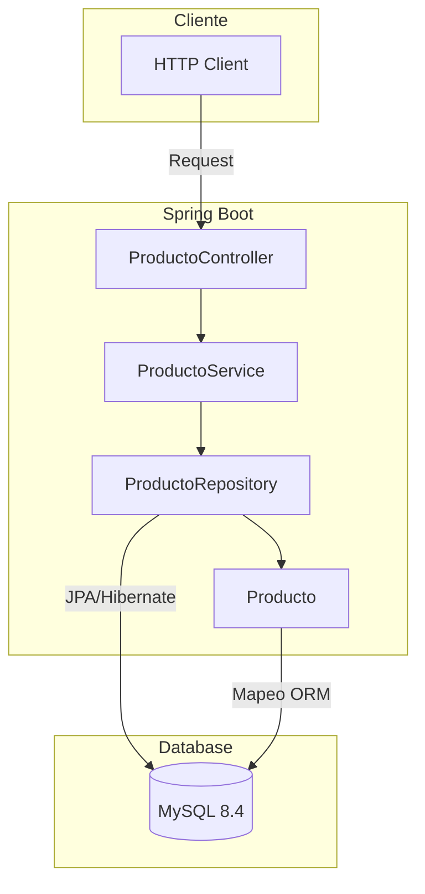

# Product API

## Tabla de Contenido

- [Descripcion del Proyecto](#descripcion-del-proyecto)
- [Stack Tecnologico](#stack-tecnologico)
- [Arquitectura](#arquitectura)
- [Esquema de Base de Datos](#esquema-de-base-de-datos)
- [Endpoints Disponibles](#endpoints-disponibles)
- [Instalacion y Ejecucion](#instalacion-y-ejecucion)

---

## 1. Descripcion del Proyecto

Proyecto siendo una API REST construida con Spring Boot para la gestion de productos. Exponiendo operaciones CRUD sobre una entidad `Producto` persistida en MySQL, implementando validacion de datos y utilizando JPA/Hibernate como capa de acceso a datos.

---

## 2. Stack Tecnologico

| Tecnologia | Version |
|---|---|
| Java | 17.0.12 |
| Spring Boot | 3.5.0 |
| Spring Data JPA | 3.5.0 |
| Spring Validation | 3.5.0 |
| Hibernate ORM | 6.6.15 |
| MySQL | 8.4 |
| Maven | 3.9.9 |
| Docker | 26.1.5 |
| Docker Compose | 2.26.1 |
| Apache Tomcat | Embebido en Spring Boot |
| XAMPP | 8.2.12-0 |

---

## 3. Arquitectura

Proyecto implementando el patron **MVC (Model-View-Controller)** adaptado a una API REST:



**Capas:**

- **Controller** — ProductoController manejando peticiones HTTP y delegando al service.
- **Service** — ProductoService conteniendo la logica de negocio.
- **Repository** — ProductoRepository extendiendo JpaRepository para acceso a datos.
- **Model** — Producto siendo la entidad JPA mapeando la tabla `productos`.

---

## 4. Esquema de Base de Datos

```mermaid
erDiagram
    productos {
        BIGINT id PK "AUTO_INCREMENT"
        VARCHAR(100) nombre "NOT NULL"
        VARCHAR(255) descripcion "NOT NULL"
        DECIMAL(10,2) precio "NOT NULL"
        INT stock "NOT NULL"
    }
```

---

## 5. Endpoints Disponibles

| Metodo | Ruta | Descripcion |
|---|---|---|
| `GET` | `/api/productos/ping` | Health check del servicio |
| `GET` | `/api/productos` | Listar todos los productos |
| `GET` | `/api/productos/{id}` | Buscar producto por ID |
| `POST` | `/api/productos` | Crear un nuevo producto |
| `PUT` | `/api/productos/{id}` | Actualizar un producto existente |
| `DELETE` | `/api/productos/{id}` | Eliminar un producto |

**Ejemplo de cuerpo para POST/PUT:**

```json
{
  "nombre": "Monitor LED",
  "descripcion": "Monitor de 24 pulgadas",
  "precio": 129.99,
  "stock": 10
}
```

---

## 6. Instalacion y Ejecucion

### Requisitos previos

- Java 17+
- Maven 3.9+
- XAMPP 8.2.12-0 (instalado via script)

### a. Configurar XAMPP y base de datos

```bash
chmod +x scripts/xampp.sh
sudo ./scripts/xampp.sh
```

Esto instala XAMPP (si no está presente), arranca Apache y MySQL, crea la base de datos `webserver_db`, el usuario `springuser` y ejecuta los scripts SQL de inicialización.

### b. Encender servidor backend

```bash
mvn spring-boot:run
```

### Verificar

```bash
curl http://localhost:8081/api/productos/ping
```

---

> API ejecutandose en `http://localhost:8081`
